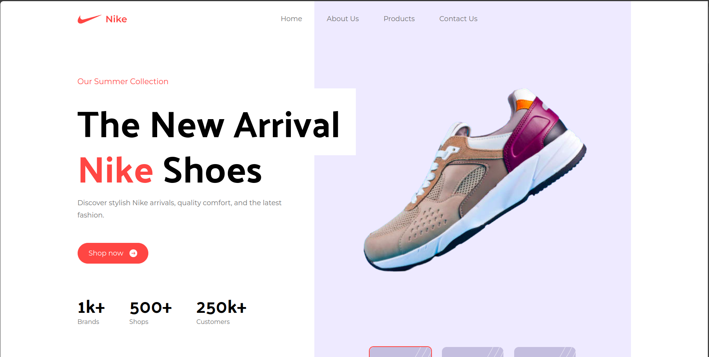
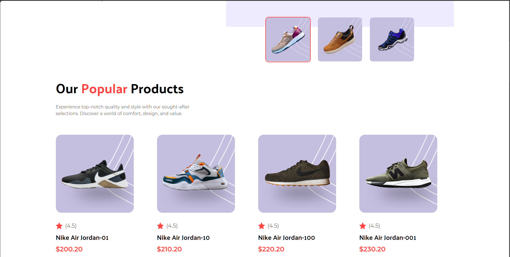
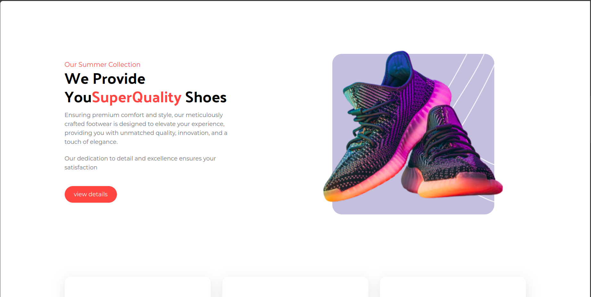
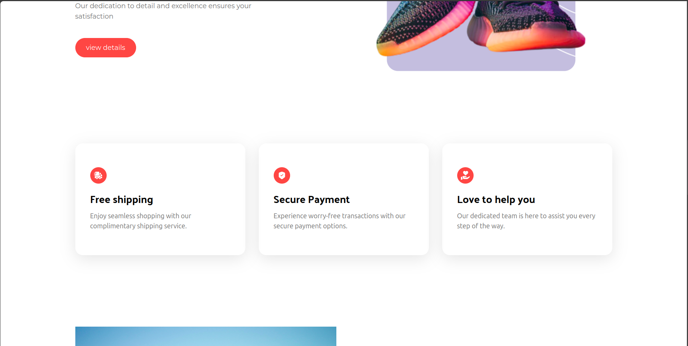
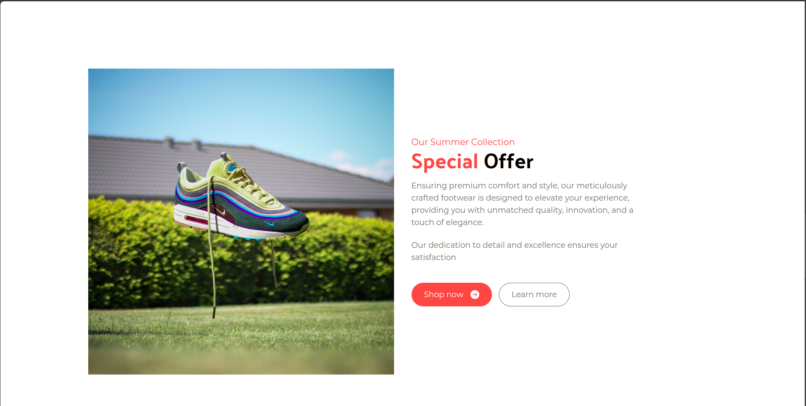
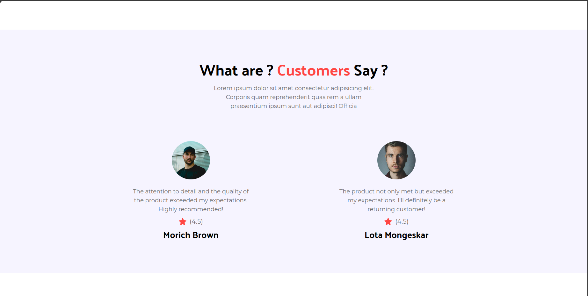
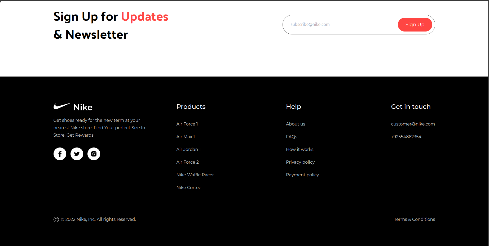

<!-- https://nike-react-vite.netlify.app/ -->

# Nike Landing Page

This is a modern, responsive Nike landing page built with React, Vite, and Tailwind CSS. The project showcases a sleek design for a Nike shoe product line, demonstrating best practices in modern web development.

## Live Demo

Check out the live demo of the project: [Nike React Vite](https://nike-react-vite.netlify.app/)

## Technologies Used

- **React**: 
- **Vite**: 
- **Tailwind CSS**: 
## Installation

To get started with the project, follow these steps:

1. Clone the repository:

   ```sh
   git clone https://github.com/mohamedsaeed22/nike-landing-page.git

   cd nike-landing-page

   ```

2. Install the dependencies:

   ```sh
   npm install
   ```

3. Start the development server:

   ```sh
   npm run dev
   ```

The application will be available at `http://localhost:5173`.

## Screenshots

Here are some screenshots of the project:









## Contributing

Contributions are welcome! Please fork the repository and create a pull request with your changes. Ensure that your code adheres to the project's coding standards and includes appropriate tests.

1. Fork the repository
2. Create a new branch (`git checkout -b feature-branch`)
3. Commit your changes (`git commit -am 'Add new feature'`)
4. Push to the branch (`git push origin feature-branch`)
5. Create a new pull request